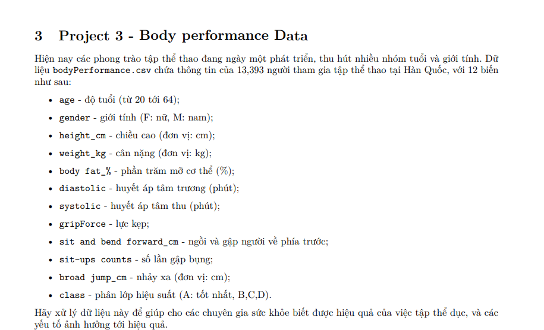

# 🏃‍♂️ Body Performance Analysis Project



## 📋 Project Overview

This project analyzes the relationship between **physical exercise** and **human health** using a comprehensive body performance dataset with **13,393 records** and **12 variables**. Our team investigated how various physical metrics correlate with fitness performance levels and developed machine learning models to classify performance into four categories: **A (Excellent)**, **B (Good)**, **C (Average)**, and **D (Poor)**.

## 🎯 Project Goals

- 🔬 **Understand the impact** of physical exercise on human health through data analysis
- 🎪 **Identify key factors** that influence fitness performance levels  
- 🤖 **Develop predictive models** to classify body performance based on physical metrics
- 📊 **Provide statistical insights** through hypothesis testing and A/B testing
- 🎨 **Create comprehensive visualizations** to communicate findings effectively

## 🔍 My Key Contributions

### 📊 Exploratory Data Analysis (EDA)
- 🧹 **Data cleaning and preprocessing**: Handled missing values, outliers, and data inconsistencies
- ⚙️ **Feature engineering**: Created new variables (`fitness_score`, `pulse_pressure`) to enhance model performance
- 📈 **Statistical analysis**: Comprehensive descriptive statistics and data distribution analysis

### 📈 Data Visualization
- 📊 **Multi-panel histograms** for all numeric variables
- ⚖️ **Comparative analysis** by gender and performance class
- 🔥 **Correlation matrix** visualization using `corrplot`
- 📦 **Box plots and violin plots** for group comparisons
- 🎯 **Bootstrap confidence intervals** visualization

### 🧪 A/B Testing & Statistical Analysis
- 🔬 **Hypothesis testing** on key metrics:
  - 💪 Grip strength differences between genders
  - 📏 Height variations across BMI categories
  - 🏋️‍♀️ Body fat percentage by performance class
- 🔄 **Permutation tests** for robust statistical validation
- 📊 **ANOVA** for multi-group comparisons

### 🤖 Machine Learning Models
Implemented and evaluated **6 classification algorithms**:

1. 🎲 **Naive Bayes** - Baseline probabilistic model
2. 📐 **Linear Discriminant Analysis (LDA)** - Linear classification approach
3. 🎯 **Multinomial Logistic Regression** - Multi-class logistic model
4. 🌳 **Decision Tree** - Interpretable tree-based model
5. 🚀 **XGBoost** - Gradient boosting ensemble
6. 🌲 **Random Forest** - Best performing model with feature importance analysis

### 📋 Model Performance Analysis
- ✅ **Cross-validation (K-fold)** for robust model evaluation
- 🎖️ **Feature importance** analysis using Random Forest
- 🎭 **Confusion matrix** and multi-class metrics evaluation
- 🏆 **Model comparison** across different algorithms

## 🏆 Key Results

- 🥇 **Best Model**: Random Forest with excellent interpretability
- 🎯 **Top Features**: Sit-and-bend forward flexibility, sit-ups count, age, fitness score
- 📊 **Statistical Insights**: Significant gender differences in grip strength and body fat percentage

## 🛠️ Technologies Used

- 💻 **R Programming Language**
- 📚 **Key Libraries**: `tidyverse`, `ggplot2`, `caret`, `randomForest`, `xgboost`, `corrplot`
- 🔬 **Statistical Methods**: Permutation testing, Bootstrap analysis, ANOVA

## 📖 Want to Learn More?

**🔍 For detailed analysis and complete findings, check out our comprehensive report:**

The **[main analysis notebook]([Group_21]_Project_CK_1_xldl.Rmd)** contains:
- ✅ **Complete statistical analysis** with p-values and significance tests
- ✅ **All visualizations** including correlation matrices, distribution plots, and model comparisons
- ✅ **Detailed model evaluation** with confusion matrices and performance metrics
- ✅ **Feature importance rankings** and interpretations
- ✅ **Bootstrap confidence intervals** for robust statistical inference
- ✅ **Vietnamese commentary** with insights and conclusions

**📊 The report provides over 20 different visualizations and statistical tests that dive deep into the relationships between physical fitness and health metrics!**

## 📄 Project Structure

```
├── [Group_21]_Project_CK_1_xldl.Rmd    # 📋 Main analysis notebook (READ THIS!)
├── Group21_Project3_Description.png    # 🖼️ Project description
├── bodyPerformance.csv                 # 📊 Dataset
└── README.md                          # 📖 Project overview
```

---

*This project showcases comprehensive data science skills including EDA, statistical testing, data visualization, and machine learning model development.*

